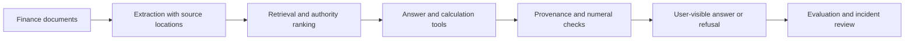

# Case study: engineering a finance document assistant

**Author:** Karim Lameer — CIMA-qualified accountant and Master Anaplanner.
**Evidence available here:** architecture records, incident reports and
dated evaluations. Application source and production systems are private.

## The problem

Finance questions depend on more than finding similar text. A number may
come from a spreadsheet cell, a calculation or a superseded report. A
useful answer needs a trace to the right source and a clear boundary when
the evidence is missing.

## My contribution and the starting point

Grounded builds on a course application with an existing retrieval and
agent stack. My additions focus on finance: cell-preserving spreadsheet
extraction, verified calculation inputs, answer checks, document authority,
evaluation, tenancy controls and operational work. The
[provenance record](PROVENANCE.md) lists the upstream capabilities and my
contribution separately. This repository does not grant access to the app.

## Three decisions worth inspecting

| Decision | Evidence | Consequence |
| --- | --- | --- |
| Keep documents as the source of truth | [ADR 0001](docs/adr/0001-files-are-the-source-of-truth.md) | Avoid making a second extracted fact store appear more authoritative than the source. |
| Bind calculations and answer checks to provenance | [ADR 0012](docs/adr/0012-trust-chain.md) | Trace computed figures to their inputs; handle missing provenance explicitly. |
| Evaluate the answer the user actually sees | [ADR 0006](docs/adr/0006-evals-grade-what-the-user-sees.md) | A correct raw response does not count if the final user-visible result is a refusal. |

The [component diagram](docs/architecture/c4-components.md) explains the
full path and where each responsibility sits.

## A debugging example

A retrieval-only experiment found that enabling the reranker made no
difference: its base URL was empty and the fallback silently returned the
unranked results. The incident record describes the configuration fix,
retry behaviour, tests and reported hit@1 change on two evaluation corpora.
The lesson became a regression requirement: prove that a stage actually ran.
[Incident 1](docs/incidents.md), [reranker ablation](evals/ablations/rerank-on-off.md).

These are the author's recorded measurements. The private application and
corpora are not supplied here for independent reproduction.

## Evaluation without overclaiming

The [Board Pack Test](https://github.com/klameer/test-your-finance-llm)
publishes a fictional corpus, questions and saved submissions. Its original
automatic grader had loose value and citation matching and incomplete
refusal checks. Historical numbers in these notes belong to that original
grader and adjudication; they are not a general accuracy guarantee.

The benchmark's [versioned grading work](https://github.com/klameer/test-your-finance-llm/tree/main/grading)
separates corrected automatic checks from the frozen release. New automatic
scores require their own recorded human adjudication before they can become
a new final-score table. No independent product validation is claimed here.

## Five-minute review path

1. Read [PROVENANCE](PROVENANCE.md) for ownership and scope.
2. Follow the [component diagram](docs/architecture/c4-components.md).
3. Read the reranker incident and one decision that was reversed, such as
   [tenancy](docs/adr/0009-pooled-tenancy-with-dedicated-as-premium.md).
4. Inspect the [evaluation methodology](evals/METHODOLOGY.md) and its limits.
5. Inspect [cost controls](docs/operations/cost-controls.md) and
   [deployment notes](docs/operations/deployment.md) for operational trade-offs.

For an interview, I would trace one question through the system, explain
my contribution to each stage, then discuss a failure, its detection and
the change it produced.
