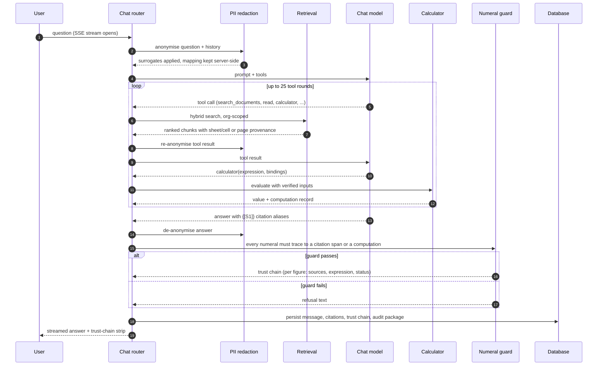

# Components: the path of one question (C4 level 3)

What happens between a question and a cited, verified answer.

## The components

**Chat router.** Owns the loop. Emits typed server-sent events: text
deltas, tool call lifecycle, citation aliases and metadata, redaction and
compaction status, sub-agent reasoning, the trust chain. The client renders
a citation chip the moment its alias arrives, before the sentence finishes.

**PII redaction.** Presidio detection, Faker surrogates. Reversible for
people, emails, phones, locations, dates, URLs; hard-redacted, never
reversed, for card numbers, national identifiers, bank numbers. Runs on the
question, on history, on tool results going to the model, and in reverse on
the answer coming back. The mapping lives in a service-role-only vault
table. See [PII pipeline](../security/pii-pipeline.md).

**Retrieval.** Full-text and vector candidates (four times the requested
top-k), fused by reciprocal rank fusion with k=60, notes merged in as two
extra ranked lists, authority weights applied (superseded and draft
documents demoted, unless the question is about versions), then the
cross-encoder reranks to the top five. Every database call carries the
organisation id. See [retrieval and answering](retrieval-and-answering.md).

**Tools.** Twenty-eight native tools. The ones that matter for finance:
`search_documents`, `analyze_document` (a sub-agent over one file),
`calculator`, `get_document_structure`, the knowledge-base file tools
(`ls`, `tree`, `grep`, `glob`, `read`), `list_notes`, `web_search`
(context only), `execute_code` (sandbox, off on managed hosts). A sandbox
bridge exposes seventeen read-only tools to sandboxed code and fails closed
on anything else, written up as a confused-deputy finding.

**Calculator.** Evaluates the expression the model proposes, over inputs
that each resolve to a cited cell. Produces a computation record that the
guard accepts as provenance and the UI renders as a derived-value chip.

**Numeral guard.** No LLM. Every numeral in the finished answer must appear
in retrieved source text (tolerant across thousands separators and scale
suffixes), be derivable by a shown computation, or be benign (small
integers, years, identifiers). Refuse mode rewrites a failing answer. The
design bias is written into the module: a false refusal is a re-ask, a
missed numeral is a lie.

**Citations.** Aliases are answer-local and renumber per turn. The client
resolves each alias to a document, a sheet and cell range or a page and
bounding box, and the viewer highlights it. A separate "check citations"
pass can ask a model to grade whether each span supports its claim; that
verdict is advisory and never on the live path.

**Audit package.** Every answer is persisted with its citations and trust
chain in a table that deliberately has no foreign key to threads, so
deleting a conversation never deletes its audit record.
