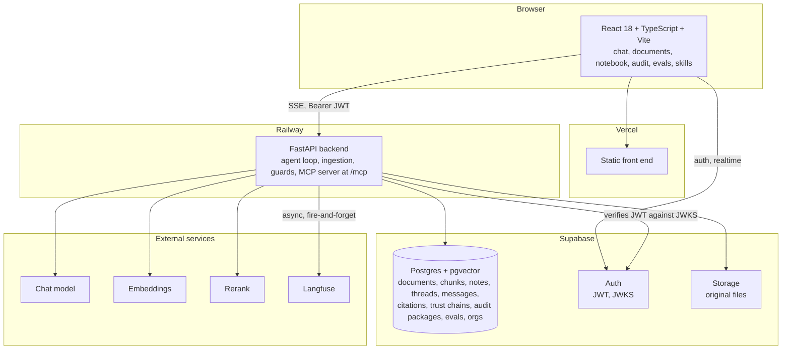

# Containers (C4 level 2)

The deployable pieces of one instance.

## The backend, by size

The backend is one FastAPI process. Seventeen routers, about 33,000 lines
of Python across services. The pieces that carry the product's promise:

| Service | Lines | What it does |
|---|---|---|
| chat router | ~3,000 | The agent loop: tool rounds, streaming, PII round-trips, guards |
| ingestion | ~2,300 | Extract, chunk, embed, store. See [ingestion](ingestion.md) |
| llm | ~2,000 | Provider routing, tool schemas, reasoning-effort mapping |
| citation | ~1,800 | Span-level citation aliases, resolution, click-through anchors |
| harness engine | ~1,600 | Multi-phase workflows (advisory, contract review) |
| redaction | ~1,500 | PII detection, surrogates, de-anonymisation |
| numeral check | ~630 | The deterministic guard (ADR 0002) |
| retrieval | ~340 | Hybrid search, fusion, authority weights, org scoping |
| calc | ~230 | Deterministic calculator with provenance (ADR 0012) |

Retrieval is small on purpose. The hard parts are in what happens before
(ingestion keeping structure) and after (guards refusing what cannot be
shown).

## Runtime limits

| Limit | Value |
|---|---|
| Tool rounds per answer | 25 (50 in deep mode, 15 per sub-agent) |
| Context compaction | Triggers at 75 percent of a 128k window; keeps 10 recent turns |
| Concurrent document ingestion | 4 per process, 2 concurrent parser conversions |
| Citation aliases per turn | 5,000 |
| Sandbox | Off on managed hosts (needs Docker); 60 s, 512 MB, 30 min session TTL when on |

## Auth

The backend verifies Supabase JWTs against the project's JWKS endpoint,
preferring asymmetric algorithms, with a cache and a forced refresh on an
unknown key id. Symmetric verification is a separate, explicitly weaker
branch so a token cannot downgrade itself. Public signup is disabled on
every instance; users are created by an administrator.
