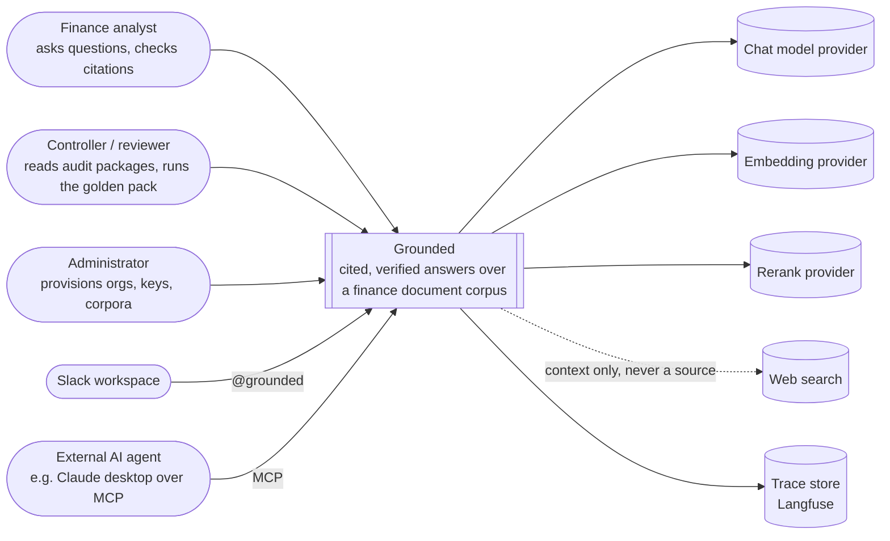

# System context (C4 level 1)

Who uses Grounded, and what it talks to.

## Boundaries that matter

- **Documents never leave the instance's database.** The chat model sees
  retrieved chunks after PII surrogates are applied; the embedding provider
  sees chunk text; the reranker sees candidate chunks. Trace masking strips
  emails, phones, card numbers and key shapes before events leave the
  process. See [security](../security/).
- **Web search is context, not evidence.** Results are labelled external in
  the answer and can never be the source of a company figure (ADR 0001).
- **An organisation can bring its own chat-model key** (ADR 0011). The
  embedding space stays instance-wide.
- **Two ways in besides the browser.** The Slack bot posts cited answers
  into channels and links back to the audited thread. The MCP server lets
  another agent ask Grounded a question and receive citations with sheet and
  cell range.

## Deployment shapes

| Shape | Who | Notes |
|---|---|---|
| Pooled instance | Default | Organisations isolated by scoped retrieval and row-level security (ADR 0009) |
| Dedicated instance | Premium | Own database, own backend, optionally own model keys or a zero-retention cloud endpoint |
| In the customer's walls | On request | Same code, their infrastructure, their enterprise model agreement |
