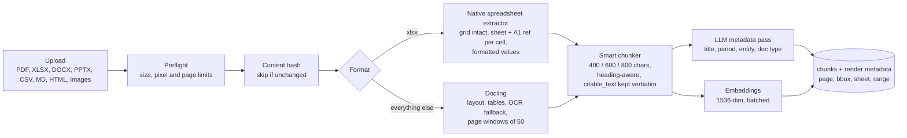

# Ingestion

Extract, chunk, embed, store. The stage where "files are the source of
truth" (ADR 0001) is either made possible or made impossible.

## Spreadsheets get their own path

A finance workbook flattened to text loses what makes it meaningful: the
row label three cells left, the column header two rows up, the merged
header above that, the sheet name, the version in the file name. Docling
handles that acceptably for a PDF table and badly for a workbook.

So workbooks go through a native extractor: every sheet is kept as an
intact grid, every cell carries its A1 reference, values are the formatted
values a reader would see, and formula cells are recalculated first (an
early corpus had every formula cell ingested as empty, which is a silent
way to lose all the totals). A citation to a workbook is therefore
"Apr Fcst · B13:W16", and the viewer highlights those cells.

## Chunking

Two strategies, one default. The smart chunker walks the markdown
structure: minimum 400 characters, target 600, maximum 800, merging small
chunks up to a hard cap of double the maximum. Headings up to 200
characters are carried as context. Each chunk stores two texts: the
enriched text that gets embedded (with heading context) and a verbatim
`citable_text` slice that citations quote from. That split is what lets a
citation be exact without making the embedding worse.

The simple fallback is a recursive character splitter at 1,000 with 200
overlap, kept for comparison.

## Hardening that was learned, not designed

| Problem seen | What was added |
|---|---|
| Native parser crash took the API process down | Process isolation for parsing, converter recycled after every document |
| One large scanned PDF exhausted memory | Preflight rejects above 250 M page pixels or 200 M image pixels; 50-page windows |
| Scanned pages with no text layer | OCR auto-detect: under 60 readable characters a page, below 0.8 readable-page ratio, 50 pages or fewer, then a blank-page OCR fallback at 3× scale |
| Deploy restarted mid-ingest, document stuck "processing" forever | Sweeper designed (ADR 0008), not yet built; cleared by hand |
| Re-uploads re-ran the metadata LLM pass and embeddings | Content-hash record manager skips unchanged files; standing rule against casual re-ingest |
| Metadata pass returned a placeholder title | Placeholder rejection with filename fallback; 45-second timeout on the pass |

## What ingestion costs

Per document: one embedding call per chunk batch and one LLM metadata call
over the first 8,000 characters. Cheap per file, expensive per corpus
re-sync, which is why a corpus sync that deletes and replaces wholesale
needs an explicit yes (see [cost controls](../operations/cost-controls.md)).

## Known limits

- CSV is accepted locally and was not on the hosted upload whitelist at
  benchmark time. That cost the product two of 34 documents in the
  published baseline (disclosed, uncompensated).
- Charts and images are not read. An OCR'd figure would reproduce the
  mis-mapping failure the fact table was rejected for (ADR 0005).
- Ingestion runs in-process. Before real pooling it moves to a worker
  (ADR 0009).
