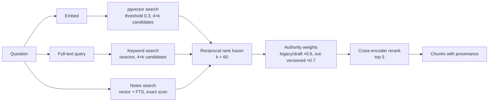

# Retrieval and answering

## Retrieval

Every database function takes the organisation id and, optionally, a set
of folder ids for scoped search. The set of chunks admitted to citation is
exactly the set retrieval returned (citation parity), so a citation cannot
reach outside the caller's scope.

**Authority weighting** is a filename-signal pass: documents whose names
say legacy, draft, superseded, or that have a higher-versioned sibling, are
demoted before rerank. It reorders and never filters, and it stands down
when the question itself is about versions or drafts. I added it because of
one benchmark question where the product cited a superseded tracker whose
figure happened to be right, and the ruling was that a superseded document
is not a valid source (ADR 0013).

**The reranker** had been in the code and never run until August
(ADR 0010). With it on, hit@1 roughly doubled on both internal corpora for
about 0.4 seconds a search.

Numbers: [rerank ablation](../../evals/ablations/rerank-on-off.md).

## Answering

The model is given tools, not chunks. It searches, reads, analyses a
document with a sub-agent, and computes with the calculator, across up to
25 rounds. What it cannot do is state a figure it did not retrieve or
compute, because the numeral guard sits after it (ADR 0002, ADR 0012).

Three modes on the same loop:

| Mode | What changes |
|---|---|
| Normal | Up to 25 tool rounds, fast citations |
| Deep | Up to 50 rounds, planning and a workspace, delegation to a deep agent that cannot itself delegate |
| Harness | A multi-phase workflow with persisted phase state. The advisory harness runs five research phases and produces a three-tier report: facts (cited), assumptions (labelled), analysis |

## Citations

An alias like `{[S3]}` in the model's output is answer-local. The chat
router resolves it as it streams, emits the citation's metadata as its own
event, and the client draws the chip before the sentence ends. Resolution
carries a document id and either a sheet plus cell range or a page plus
bounding box, which the viewers use to highlight. Aliases are tolerant:
`{[S1, S8]}`, `{[S1], [S5]}` and bare `[S1]` all resolve.

Web results and notes get their own alias families so the reader can see
the kind of source at a glance, and the trust-tier strip (ADR 0005) colours
them.

## Measured latency

From eval runs on 2026-09-10 and the 2026-08-08 gate, wall-clock per
question through the chat API on a frontier chat model:

| Question type | Typical range |
|---|---|
| Lookup | 12 to 20 s |
| Consistency / version | 24 to 38 s |
| Computation | 15 to 36 s |
| Cross-document reconciliation | 41 to 81 s |
| Full-suite mean | 28 s (rail), 36 s (biotech) |

Tokens per turn average about 25,000, almost all prompt (a sampled turn:
17,662 prompt, 271 completion). Prompt caching takes about 77 percent of
that off the bill; see [cost controls](../operations/cost-controls.md).

This is slow for a chatbot and fine for a controller. I do not
compete on speed with a raw model; it competes on what survives an audit.
