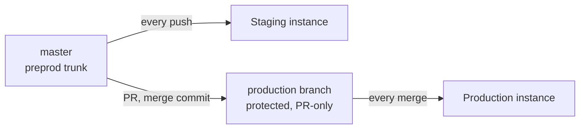

# Deployment

One repository, many instances. An instance is one Supabase project, one
Railway service and one Vercel project, wired together by environment
variables. Staging tracks `master`; production tracks a protected
`production` branch that only moves by pull request with a merge commit, so
`git diff master production` is empty after every promotion. Customer
instances pin a release tag.

## What I got wrong, in order

| Incident | Rule that followed |
|---|---|
| Chose a host whose 512 MB and 2 GB tiers both died on one PDF parse, because the parser pulls PyTorch | Size the heaviest dependency import before choosing a host. Moved to Railway |
| Demo database ten migrations behind master for two weeks while code auto-deployed | Dry-run migrations before every promotion; migrations first, code second (ADR 0007) |
| Every promotion for 26 days failed its health check while the old deployment kept serving; cause was a boolean set to an empty string | After every promotion, confirm a new deployment is active. Merge success is not deploy success |
| Provider switch left three stale model ids behind; every citation grade came back "verification failed" | Sweep all model and token variables on any provider switch |
| Bare `role()` and `uid()` in policies worked locally and failed on cloud | Schema-qualify auth functions in every policy |
| Platform variable edits were staged, not applied, and I moved on | Verify variables after saving, not after typing |
| The real backend lived in an auto-named project; a project named for the backend held a dead service | Rename projects to what they are the day they are created |

Full stories: [incidents](../incidents.md).

## Detail

| Piece | Host | Notes |
|---|---|---|
| Database, auth, storage | Supabase | Public signup off. Point-in-time recovery to confirm before the first paying customer |
| Backend | Railway | Root `backend`, Python 3.13 pinned, extra apt packages for the parser's image libraries |
| Front end | Vercel | Public variables baked at build time. The service-role key never goes here |
| Traces | Langfuse Cloud | One project, environment tags |

Cost of an instance: roughly $25 a month for the database tier plus $7 to
$25 for the backend depending on load. Inference on top, see
[cost controls](cost-controls.md).
