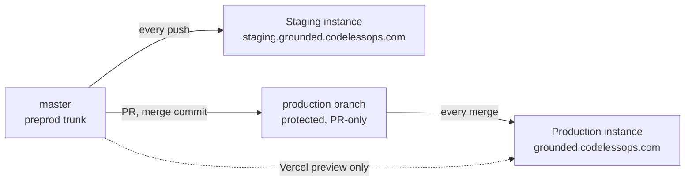

# Deployment

One repository, many instances. An instance is one Supabase project, one
Railway service and one Vercel project, wired together by environment
variables.

## Promotion

- `master` deploys to staging on every push.
- `production` is a protected branch (pull-request only, admins included,
  no force-push, no delete). Production hosting tracks it. A push to master
  deploys nothing to production.
- Promotion is a pull request from master to production, merged with a
  merge commit, never squashed, so the two histories stay identical and
  `git diff master production` is empty after every promotion.
- Cloud migrations are applied by hand, additive first, before the code
  that needs them is promoted, after a dry run (ADR 0007).
- Customer instances pin a release tag and bump only after that instance's
  golden pack passes.

## What is where

| Piece | Host | Notes |
|---|---|---|
| Database, auth, storage | Supabase | Pro tier per real instance. Public signup off. Point-in-time recovery to be confirmed before the first paying customer |
| Backend | Railway | Root `backend`, custom start command, Python pinned to 3.13, extra apt packages for the image libraries the parser pulls in |
| Front end | Vercel | Root `frontend`, Vite preset, public variables baked at build time. The service-role key never goes here |
| Traces | Langfuse Cloud | One project, environment tags |

## Why Railway and not Render

The document parser pulls PyTorch. A single PDF parse exhausted Render's
512 MB tier and its 2 GB tier. Render's next tier was $85 a month. Railway's
hobby tier allows up to about 8 GB per service on usage billing. Lesson:
size the heaviest dependency import before choosing a host.

## Things that bit

| Incident | What changed |
|---|---|
| Demo database ten migrations behind master for two weeks while code auto-deployed | Manual dry run before every promotion; migrations go first |
| Every promotion for 26 days failed its health check while the old deployment kept serving. A platform variable set to an empty string crashed the settings parser on boot | Empty strings are not booleans. After every promotion, confirm a new deployment is active |
| Provider switch left three stale model ids behind; every citation grade came back "verification failed" | Sweep all model and token variables on any provider switch |
| Bare `role()` and `uid()` in policies worked locally and failed on cloud | Always schema-qualify auth functions in policies |
| Platform variable edits are staged until "apply" is clicked | Verify variables after saving, not after typing |
| Hosting dashboard showed a project named for the backend that contained a dead service; the real backend lived in an auto-named project | Rename projects to what they are the day they are created |

## Cost of an instance

Roughly $25 a month for the database tier plus $7 to $25 for the backend
depending on load; front-end and repository hosting free at this scale.
Inference on top, see [cost controls](cost-controls.md).
