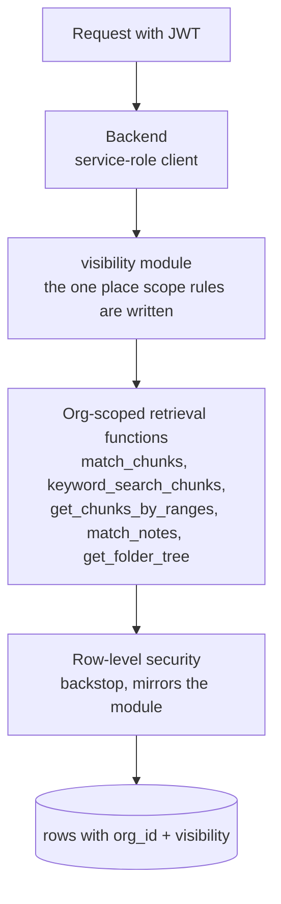

# Isolation

How one organisation's documents stay invisible to another inside a pooled
instance (ADR 0009), and how an instance stays closed to the outside.

## Three layers inside the database

1. **The visibility module.** The backend talks to the database as the
   service role, which bypasses row-level security. That means the filter
   strings this module builds are the enforcement, and they are written in
   exactly one place. The module is explicit about this in its header.
2. **Organisation-scoped functions.** All five retrieval functions take
   the organisation id as a parameter and apply it inside the function.
   Citation parity follows: grounding admits exactly what retrieval
   surfaced.
3. **Row-level security as backstop.** Policies mirror the module for any
   path that uses a user-scoped client. The two are kept in lockstep by a
   drift-pin test that fails if a function grant or a policy changes.

Every content table carries an organisation id and a visibility column
(private or organisation; skills add platform). The old sentinel of "owner
is null means shared" was retired. It had a real bug: sharing a folder
cascaded the null owner down the subtree and left descendants ownerless,
and shared folders were invisible to retrieval while visible in the tree.

## What the tests pin

95 security and isolation test functions, by file:

| Suite | Tests | What it proves |
|---|---|---|
| Isolation | 40 | A user cannot read, cite or list another user's private content |
| Organisation isolation | 13 | Same-org retrieve and cite works; cross-org is a wall; unshare revokes |
| RLS state | 13 | Every table has RLS on; function grants match the pinned list |
| Input | 9 | Injection through document names, folder names, query strings |
| Auth | 8 | JWT algorithm downgrade, expired tokens, unknown key id |
| LLM injection | 8 | Instructions inside documents do not become tool calls |
| Skill poisoning | 2 | A shared skill cannot exfiltrate through tool arguments |
| Error handling | 2 | Errors do not leak other tenants' identifiers |

Writing the RLS pins, I found two pre-existing gaps: one retrieval function
was executable by the anonymous role, and the notes table had no pin.

## Secrets

- Per-organisation model keys are envelope-encrypted with a master key held
  in the environment (ADR 0011). The table has RLS enabled and no policies,
  which means service role only. Same pattern as the PII vault.
- Organisations pick a model from an allow-list and can never set a base
  URL. That closes a server-side request forgery route through a shared
  key.
- Platform secrets live in the hosting platform's variables, never in the
  application database and never in an admin screen.
- The trace store's secret key never reaches the browser. Thumbs-up and
  thumbs-down go through an authenticated backend endpoint, and an
  end-to-end test asserts no trace-store secret appears in the front-end
  bundle.

## The sandbox bridge

Sandboxed code can call back into the application. The bridge exposes
seventeen read-only tools and fails closed on anything else. Excluded by
name: code execution, skill saving, file writes and edits, delegation, tool
search. The rationale is written up in the settings module as a confused-
deputy finding: code the model wrote must not be able to do more than the
model could.

## Perimeter

- Public signup is disabled on every instance. Users are created by an
  administrator.
- JWTs are verified against the auth provider's JWKS with asymmetric
  algorithms preferred and a separate, weaker symmetric branch that a token
  cannot select.
- The sandbox is off on managed hosts because it needs Docker.
