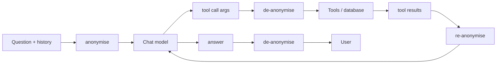

# PII pipeline

Personal data in a finance corpus is mostly names: employees in a headcount
extract, customers in an aged-debt report, directors in board minutes. The
pipeline's job is to keep those out of the model provider's logs while
keeping answers readable.

The detection and surrogate machinery came with the base scaffold (see
[PROVENANCE](../../PROVENANCE.md)). What follows describes how it behaves in
Grounded, the invariant I added for numbers, and what it does not cover.

## Two classes of entity

| Class | Entities | Treatment |
|---|---|---|
| Reversible | Person, email, phone, location, date-time, URL, IP | Replaced with a consistent fake surrogate before the model sees it; reversed in the answer |
| Hard redaction | Card number, national identifiers, bank number, IBAN, crypto address, passport, driving licence, medical licence | Replaced with a type marker; never reversed |

Detection is Presidio with a confidence threshold of 0.7 for surrogates and
0.3 for hard redaction (lower, because a false positive on a card number is
cheap and a miss is not). A secondary LLM pass on a local or private model
scans for what the rule-based detector missed. Surrogates are generated by
Faker with name-parsing and nickname handling so "Jane", "Ms Smith" and
"J. Smith" map to one consistent fake person, and a gender guess keeps
pronouns coherent.

## Where it runs

The model only ever sees surrogates. Tools and the database only ever see
real values. The mapping lives in a vault table that has RLS enabled and no
policies, so it is readable by the service role alone and never crosses the
REST layer. Per-thread entity registries keep surrogates stable across a
conversation. Compaction summaries are built from the anonymised history.
Redaction and compaction stay on the instance's configured model
provider even when chat runs on a separate subscription path, so the
redaction step does not add a second provider that sees raw content.

Trace masking is a separate, regex-based pass on events leaving for the
trace store: emails, phones, card shapes, API-key shapes.

## The numerals invariant

Surrogates must never touch a number that could be a figure. Early on the
date-time surrogate rewrote "December FY26" in a question into a random
fake date, and every date-bearing finance question on the hosted demo came
back with "those dates match no document". Two fixes followed: a test that
pins numerals through the anonymise and de-anonymise round trip (part of
the trust-chain work), and a per-instance switch so a corpus that is
entirely synthetic can run with redaction off.

## What it does not cover

- **Stack traces and error reports.** If an error-reporting service is
  ever added it must send no request bodies, no locals and no breadcrumbs,
  and be disclosed as a subprocessor. The pipeline redacts documents, not
  tracebacks.
- **Figures.** By design. A salary is a number and a number is evidence.
  Access control, not redaction, is the answer to "who may see salaries",
  and that is what the isolation layer does.
- **Images.** Not read at all.

## Cost of the pipeline

Zero when disabled: the anonymise step is skipped, not run and discarded,
and streaming is untouched. When enabled it adds one detection pass per
message and per tool result, on a small local model or rule-based only, so
the added latency is well under a second per round.
